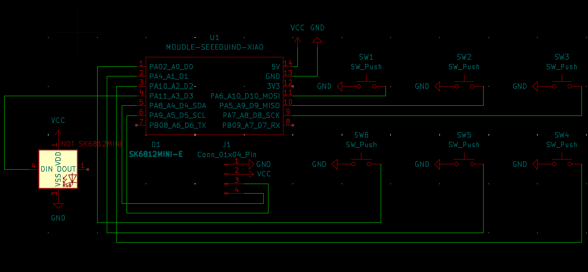
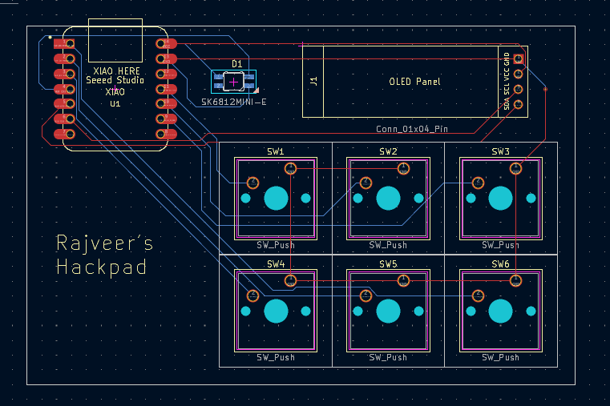
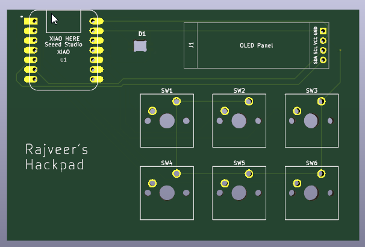
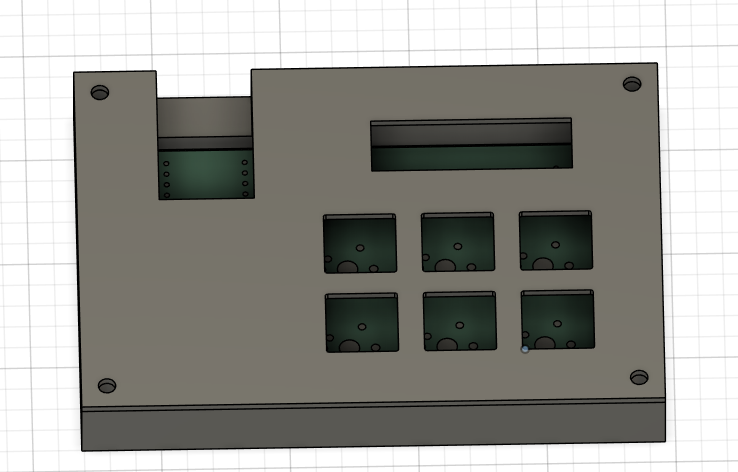
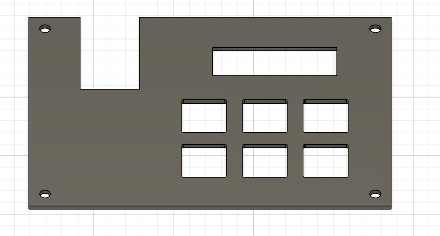
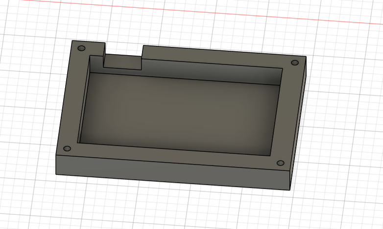

# Hackpad
My own very little hackpad!

## BOM (Bill of materials)
 - Seeed XIAO RP2040 ×1
 - MX-style mechanical switches ×6
 - Blank DSA keycaps (white) ×6
 - 0.91 inch OLED display (SSD1306, I2C) ×1
 - SK6812 MINI-E RGB LED ×1
 - M3 × 16 mm screws ×4
 - M3 heat-set inserts ×4
 - 3D printed case ×1
## PCB
  
  
  
## CAD
  
  
  
## Firmware
I am using KMK firmware for the hackpad.